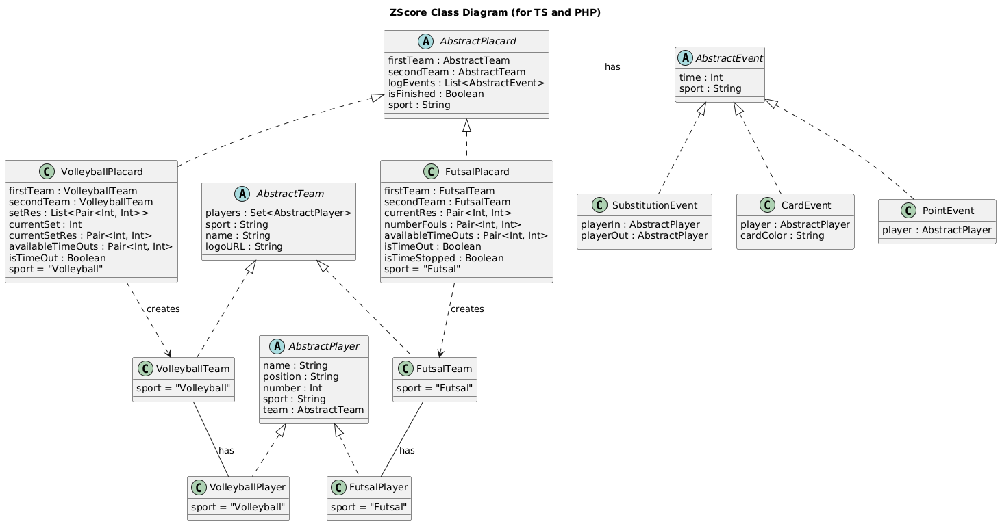
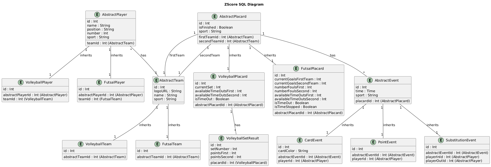

# Documentation for ZScore System

This document provides an overview of the classes and database tables used in the ZScore system. The diagrams below illustrate the relationships between the entities. The Placard, Teams and Players classes are based on Factory Pattern and Abstract Factory Pattern.

## Class Diagram

The class diagram represents the structure of the system's classes and their relationships.

---

## SQL Tables Diagram

The SQL diagram represents the database schema for the ZScore system.

---
